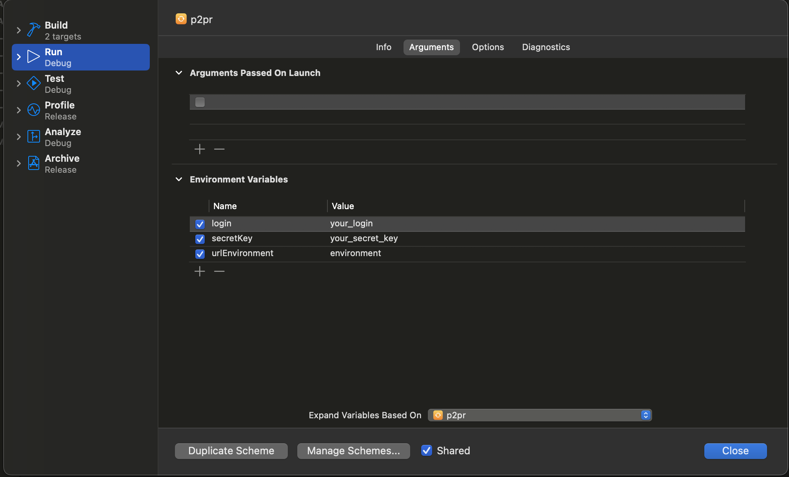
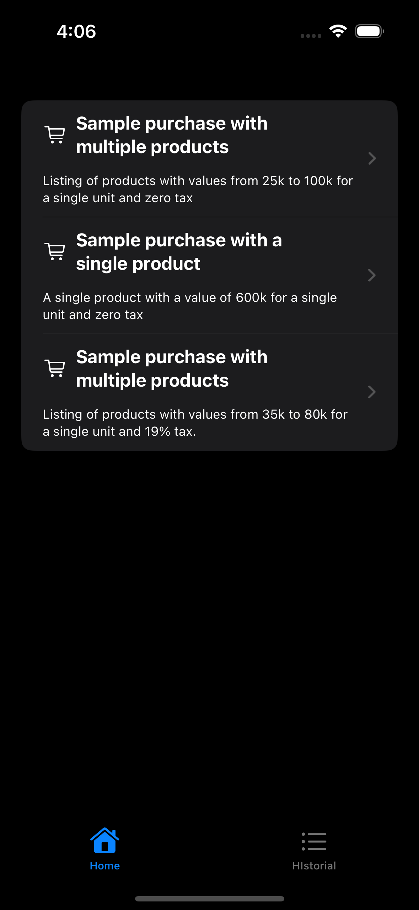
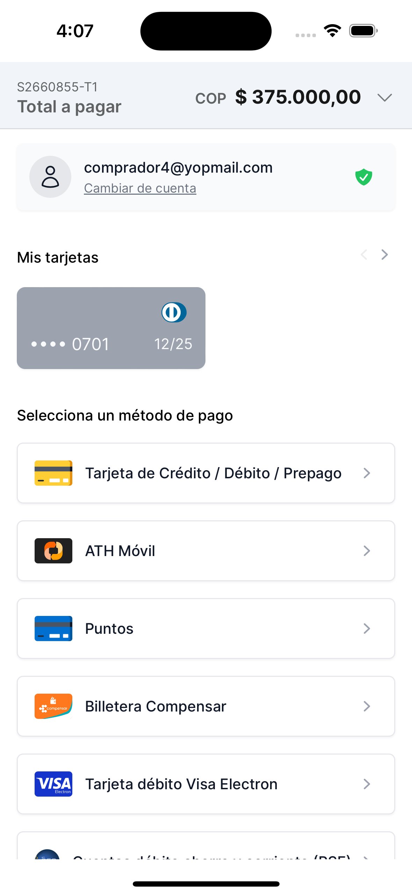

# PlacetoPay Redirection


Con este ejemplo podrá conectarse rápidamente con los servicios de Checkout de PlacetoPay.

Para ver ejemplos más completos de cómo funciona, consulte los ejemplos y
la [documentación](https://docs.placetopay.dev/checkout).

***

## Tabla de contenido

### Integrando Checkout

- [Autenticación](#autenticación)
    - [Requerimientos](#requerimientos)
    - [Como generar la autenticación](#como-generar-la-autenticación)
- [Configuración de servicios](#configuración-de-servicios)
- [Crear una sesión de pago](#crear-una-sesión-de-pago)
- [Consultar una sesión](#consultar-una-sesión)
- [Configurar la WebView](#configurar-la-webview)

### App de prueba

- [Prueba los credenciales](#prueba-los-credenciales)
- [Preview](#preview)
- [Glosario](#glosario)

### Versión
- [Inglés](README.md)

***

## Autenticación

El parámetro de __auth__ debe enviarse en __todas las solicitudes del API__ y contiene el conjunto de propiedades necesarias para verificar la autenticación.

### Requerimientos

> Para integrarse con Checkout, debe tener sus credenciales de `login` y `secretKey`.

- `login`: El identificador del sitio puede considerarse público, ya que viaja como datos simples en las solicitudes de API.
- `secretKey`: Clave secreta del sitio, debe ser privada, a partir de este dato se generará una nueva `tranKey` que será
  enviado en las solicitudes.

> Estas credenciales son exclusivas de su sitio y deben tratarse de forma segura.
>
> No comparta sus credenciales en lugares de acceso público como Github, código del lado del cliente u otros lugares con acceso fácil de terceros.

### [Como generar la autenticación](https://docs.placetopay.dev/en/checkout/authentication#how-to-generate-your-authentication)

Debes preparar la siguiente información:

| Parámetro   | Descripción                                                                                                                                                                          |
|:------------|:-------------------------------------------------------------------------------------------------------------------------------------------------------------------------------------|
| `login`     | Identificador del sitio, credencial proporcionado al iniciar su integración.                                                                                                         |
| `secretKey` | Clave secreta del sitio, credencial proporcionada al iniciar su integración.                                                                                                         |
| `seed`      | Esta es la fecha en que se generó la autenticación. La fecha debe estar en formato ISO 8601.                                                                                         |
| `nonce`     | Cadena de texto aleatorio que identifica una solicitud como única. Se genera y se utiliza para crear `tranKey` sin codificación base64. Al enviarlo debe estar codificado en base64. |
| `tranKey`   | Generado en cada solicitud. Se genera con las siguiente fórmula Base64(SHA-256(nonce + seed + secretKey)).                                                                           |

> Para este ejemplo, se está utilizando un entorno de Colombia.
> Para obtener más información, consulte los [directorios de entornos](https://docs.placetopay.dev/en/checkout/test-your-integration#directory-of-environments)

***

La clase de ejemplo `CheckoutAuth` se utiliza como parámetro de la solicitud en operaciones de autenticación.
La clase incluye métodos privados para cálculos criptográficos, garantizando la seguridad y confidencialidad de los datos de autenticación.

``` swift
class CheckoutAuth: Codable {
    var login: String
    private(set) var nonce: String
    private(set) var seed: String
    private(set) var tranKey: String
    
    enum CodingKeys: String, CodingKey {
        case login, nonce, seed, tranKey
    }
    
    init(login: String, secretKey: String) {
        self.login = login
        self.seed = ""
        self.nonce = ""
        self.tranKey = ""
        self.generateAuth(secretKey: secretKey)
    }
    
    private func generateAuth(secretKey: String) {
        let rawNonce = UInt64.random(in: 0..<1000000)
        self.seed = ISO8601DateFormatter.string(from: Date(), timeZone: .current, formatOptions: .withInternetDateTime)
        let hashedData = SHA256.hash(data: "\(rawNonce)\(self.seed)\(secretKey)".data(using: .utf8)!)
        self.tranKey = Data(hashedData).base64EncodedString()
        self.nonce = Data(String(rawNonce).utf8).base64EncodedString()
    }
    
}
```

`CheckoutAuth` como parámetro en el cuerpo de la solicitud en JSON.

``` json
{
    "login": "c51ce410c124a10e0db5e4b97fc2af39",
    "tranKey": "VQOcRcVH2DfL6Y4B4SaK6yhoH/VOUveZ3xT16OQnvxE=",
    "nonce": "NjE0OWVkODgwYjNhNw==",
    "seed": "2023-10-17T16:22-0500"
}
```

> Errores frecuentes, consulte los [posibles errores](https://docs.placetopay.dev/en/checkout/authentication#possible-errors).

***

### Configuración de servicios

Cree el service interface para los endpoints de [`Create Session`](#crear-una-sesión-de-pago)
y [`Query Session`](#consultar-una-sesión).

> La implementación de los servicios debe tener como `baseUrl` el [entorno](https://docs.placetopay.dev/en/checkout/test-your-integration#directory-of-environments) acorde a la versión de la app.
> 
> El __Body__ de la petición debe contener el parámetro __auth__ de tipo `CheckoutAuth` o el struct/class responsable de la autenticación.

``` swift
protocol CheckoutRepository {
    func createSession(package: WelcomePackage, buyer: Buyer, ipAddress: String, handler: @escaping (Result) -> Void) async
    func searchSession(sessionId: Int, handler: @escaping (Result) -> Void) async
    ...
}

class CheckoutPaymentRepository: CheckoutRepository {
    var baseUrl: String
    
    init(baseUrl: String) {
        self.baseUrl = baseUrl
    }
    
    func createSession(package: WelcomePackage, buyer: Buyer, ipAddress: String, handler: @escaping (Result) -> Void) async {
        do {
            let paymentRequest:CheckoutPaymentRequest = .init(package: package, buyer: buyer, ipAddress: ipAddress)
            let body = try JSONEncoder().encode(paymentRequest)
            
            try await RequestManager().request(
                from: baseUrl + "/api/session",
                decodeType: CheckoutPaymentResponse.self,
                method: .post,
                body: body,
                completionHandler: handler
            )
        } catch _ {
            handler(ResultError(error: .networkError("Error connecting to server", 500)))
        }
    }
    
    func searchSession(sessionId: Int, handler: @escaping (Result) -> Void) async {
        ...
    }
    
    ...
}
```

***

### [Crear una sesión de pago](https://docs.placetopay.dev/en/checkout/api-reference/session#create-a-session)

Creando una nueva solicitud de pago para obtener una URL de pago de la sesión.

Simplemente, proporcione la información del pago necesario y obtendrá una URL del proceso si se realiza correctamente. Para este ejemplo,
están utilizando la **Información básica** que debe proporcionarse; para ver la estructura completa, consulte
la [documentación](https://docs.placetopay.dev/en/checkout/create-session).

La clase de ejemplo `CheckoutPaymentRequest` se utiliza como cuerpo de solicitud. La clase incluye el pago, comprador, envío y otra información.

``` swift
struct CheckoutPaymentRequest: Codable {
    
    var auth: CheckoutAuth?
    var buyer: CheckoutBuyer?
    var cancelUrl: String?
    var captureAddress:Bool? = false
    var expiration: String
    var fields: [CheckoutField]?
    var locale: String
    var noBuyerFill: Bool? = false
    var payment: CheckoutPayment?
    var returnUrl: String
    var ipAddress: String
    var skipResult: Bool? = false
    var userAgent = USER_AGENT
    
    enum CodingKeys: String, CodingKey {
        case auth, buyer, cancelUrl, captureAddress, expiration, fields, locale, noBuyerFill, payment, returnUrl, ipAddress, skipResult, userAgent
    }
    
    init(package: WelcomePackage, buyer: Buyer, ipAddress: String) {
        self.auth = .init(login: LOGIN_CHECKOUT, secretKey: SECRET_KEY_CHECKOUT)
        self.buyer = .init(buyer: buyer)
        self.cancelUrl = CANCEL_URL
        self.expiration = Calendar.autoupdatingCurrent.date(byAdding: .day, value: 1, to: Date())!.toString()
        self.fields = nil
        self.locale = "es_CO"
        self.payment = .init(package: package, buyer: buyer)
        self.returnUrl = RETURN_URL
        self.ipAddress = ipAddress
    }
}
```

`CheckoutPaymentRequest` como parámetro en el cuerpo de la solicitud en JSON.

> Consulte [el pago básico completo](examples/basic_payment_request.json)

``` json
{
  "auth": {
    "login": "c51ce410c124a10e0db5e4b97fc2af39",
    ...
  },
  "expiration": "2023-10-17T23:13-0500",
  "locale": "es_CO",
  "payment": {
    "amount": {
      "currency": "COP",
      "details": [
        {
          "amount": 150000.0,
          "kind": "subtotal"
        },
        ...
      ],
      "total": 165000.0,
      ...
    },
    "buyer": {
      ...
    },
    "items": [
      {
        "category": "Books",
        "name": "Libro antiguo",
        "price": 80000,
        "qty": 1,
        "sku": 302,
        "tax": 15200.0
      },
      ...
    ],
    "reference": "3"
  },
  "returnUrl": "redirection://receipt?return",
  "userAgent": "Mozilla/5.0 (X11; Linux x86_64) Chrome/52.0.2743.116 Safari/537.36 ...",
  ...
}
```

La clase de ejemplo `CheckoutPaymentResponse` se utiliza como cuerpo de respuesta. La clase incluye el estado, la identificación de la solicitud y la URL de pago.

``` swift
class CheckoutPaymentResponse: Decodable, Result {
    
    var status: CheckoutStatus
    var requestId: Int?
    var processUrl: String?
    var date: String?
}
```

`CheckoutPaymentResponse` como parámetro en el cuerpo de la solicitud en JSON.

``` json
{
  "status": {
    "status": "OK",
    "reason": "PC",
    "message": "La petición se ha procesado correctamente",
    "date": "2023-10-18T15:02:20-05:00"
  },
  "requestId": 2630139,
  "processUrl": "https://checkout-test.placetopay.com/spa/session/2630139/7149a8cf3..."
}
```

---

### [Consultar una sesión](https://docs.placetopay.dev/en/checkout/api-reference/session#query-a-session)

Este endpoint le permite obtener la información de la sesión, si hay transacciones en la sesión, los detalles
de los mismos se muestran.

La clase de ejemplo `CheckoutInformationRequest` se utiliza como cuerpo de la solicitud. La clase incluye información de la autenticación.

``` swift
struct CheckoutInformationRequest: Codable {
    var auth: CheckoutAuth
    
    enum CodingKeys: String, CodingKey {
        case auth
    }
    
    init() {
        self.auth = .init(login: LOGIN_CHECKOUT, secretKey: SECRET_KEY_CHECKOUT)
    }
}
```

`CheckoutInformationRequest` como parámetro en el cuerpo de la solicitud en JSON.

``` json
{
  "auth": {
    "login": "c51ce410c124a10e0db5e4b97fc2af39",
    "nonce": "NjE0OWVkODgwYjNhNw==",
    "seed": "2023-10-17T17:13-0500",
    "tranKey": "VQOcRcVH2DfL6Y4B4SaK6yhoH/VOUveZ3xT16OQnvxE="
  }
}
```

La clase de ejemplo `CheckoutInformationResponse` se utiliza como cuerpo de la respuesta. La clase incluye el estado, la identificación de la solicitud e información de pago.

``` swift
struct CheckoutInformationResponse: Decodable, Result {
    var status: CheckoutStatus
    var requestId: Int?
    var request: CheckoutPaymentRequest?
    var payment: [CheckoutPaymentInformation]?
}
```

`CheckoutInformationResponse`  como parámetro en el cuerpo de la solicitud en JSON.

>  Consulte [la respuesta de completa](examples/information_response.json)

``` json
{
  "requestId": 2630139,
  "status": {
    "status": "APPROVED",
    "reason": "00",
    "message": "La petición ha sido aprobada exitosamente",
    "date": "2023-10-18T15:02:42-05:00"
  },
  "request": {
    "locale": "es_CO",
    "payer": {
      "document": "1040035001",
      ...
    },
    "payment": {
      "reference": "2",
      "amount": {
        "details": [
          {
            "kind": "shipping",
            "amount": 15000
          },
          ...
        ],
        "currency": "COP",
        "total": 65000
      },
      "items": [
        ...
      ],
      ...
    },
    "fields": [
      {
        "keyword": "_processUrl_",
        "value": "https://checkout-test.placetopay.com/spa/session/2630139/7149...",
        "displayOn": "none"
      },
      ...
    ],
    "returnUrl": "redirection://receipt?return",
    "userAgent": "Mozilla/5.0 (X11; Linux x86_64) Chrome/52.0.2743.116 Safari/537.36 ...",
    ...
  },
  "payment": [
    {
      "amount": {
        ...
      },
      "status": {
        "date": "2023-10-18T15:02:39-05:00",
        "status": "APPROVED",
        ...
      },
      "issuerName": "JPMORGAN CHASE BANK, N.A.",
      "paymentMethod": "visa",
      "processorFields": [
        {
          "value": "012988341",
          "keyword": "merchantCode",
          "displayOn": "none"
        },
        ...
      ],
      "paymentMethodName": "Visa",
      ...
    }
  ],
  "subscription": null
}
```

---

### Configurar la WebView

Puedes usar la vista `CheckoutWebView` para una correcta visualización de Checkout.

Estas configuraciones ayudan a optimizar y personalizar la experiencia de navegación dentro del WebView. Es importante
que puedas identificar cuál es la URL de retorno y la URL de cancelación para poder cerrar el WebView una vez finalice
el proceso de pago.

``` swift
struct CheckoutWebView: UIViewRepresentable {
    let url: String
    
    func makeUIView(context: Context) -> WKWebView {
        let wkWebView = WKWebView()
        wkWebView.navigationDelegate = context.coordinator
        return wkWebView
    }
    
    func updateUIView(_ webView: WKWebView, context: Context) {
        let request = URLRequest(url: URL(string: url)!)
        webView.load(request)
    }
    
    func makeCoordinator() -> WebViewCoordinator {
        WebViewCoordinator(self)
    }
    
    class WebViewCoordinator: NSObject, WKNavigationDelegate {
        var parent: CheckoutWebView
        
        init(_ parent: CheckoutWebView) {
            self.parent = parent
        }
        
        func webView(_ webView: WKWebView, decidePolicyFor navigationAction: WKNavigationAction, decisionHandler: @escaping (WKNavigationActionPolicy) -> Void) {
            if navigationAction.navigationType == .other {
                if let urlStr = navigationAction.request.url?.absoluteString, urlStr == returnUrl || urlStr == cancelUrl {
                    parent.showWebView = false
                    decisionHandler(.cancel)
                    return
                }
            }
            
            decisionHandler(.allow)
        }
    }
}
    
```

> Si deseas eliminar las cookies y el almacenamiento del webview, consulta [clean cookies and data storage](https://gist.github.com/AddsDev/833788605e42857ff266617535af3c09)

---

## Prueba los credenciales

- Clona este repositorio en tu máquina local.

```
git clone https://github.com/placetopay-org/checkout-ios.git
```

- Abrir el proyecto en XCode.
- Configurar los credenciales de `login`, `secretKey` y `urlEnvironment` en



- Build y run.

---

## Preview







---

### Glosario

| Nombre      | Descripción                                                                                                                        |
|:------------|:-----------------------------------------------------------------------------------------------------------------------------------|
| `login`     | Identificador del sitio, puede considerarse público porque viaja como datos simples en las solicitudes del API.                    |
| `secretKey` | Clave secreta del sitio, debe ser privada, a partir de estos datos se generará una nuevo `tranKey` que se enviará en la solicitud. |
| `tranKey`   | Generado en cada solicitud.                                                                                                        |
| `nonce`     | Cadena de texto aleatorio que identifica una solicitud como única.                                                                 |
| `seed`      | Esta es la fecha en que se generó la autenticación.                                                                                |
| `baseUrl`   | [URL del entorno](https://docs.placetopay.dev/en/checkout/test-your-integration#directory-of-environments).                        |
