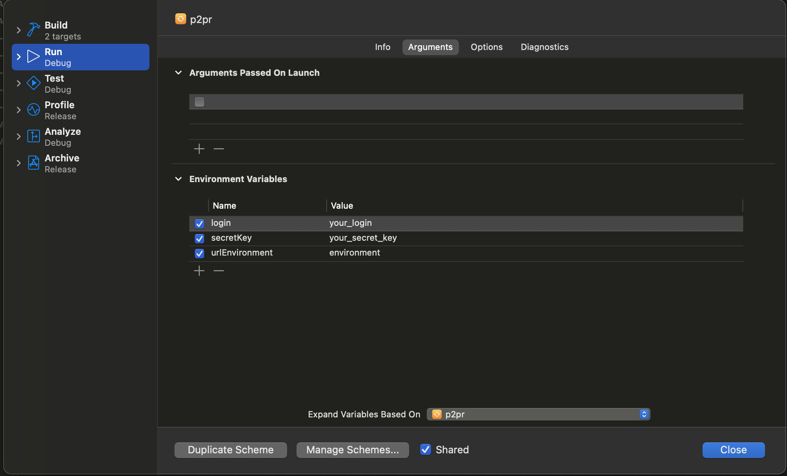
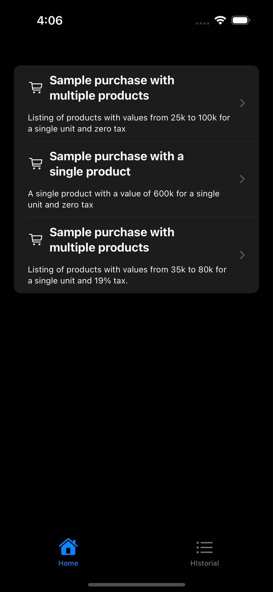
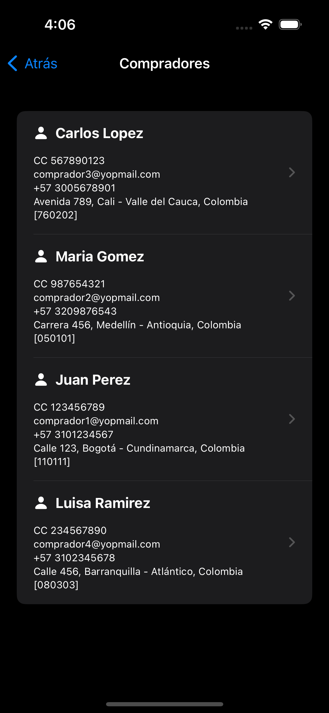
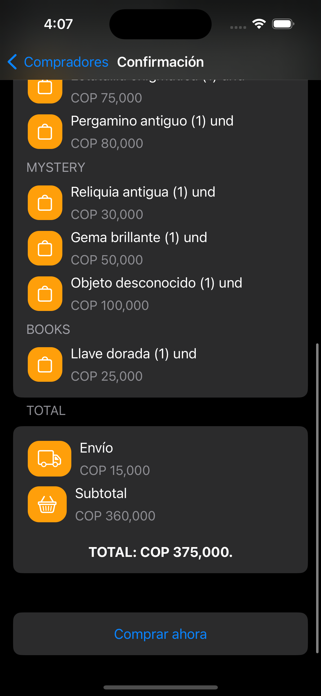
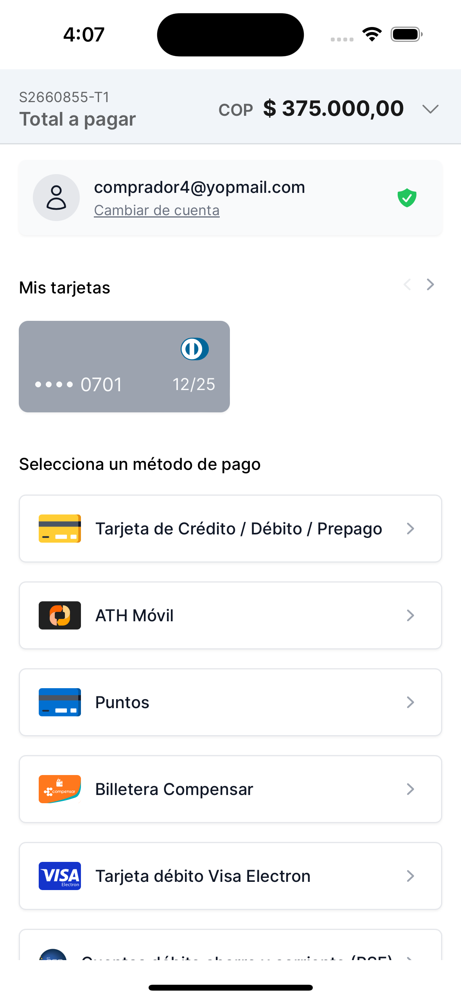
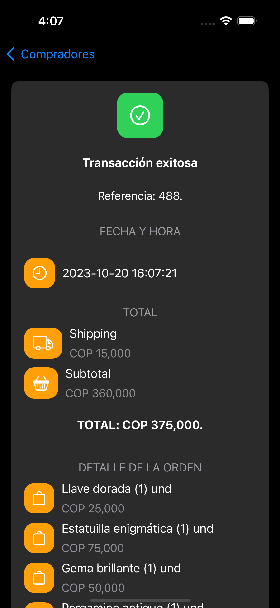
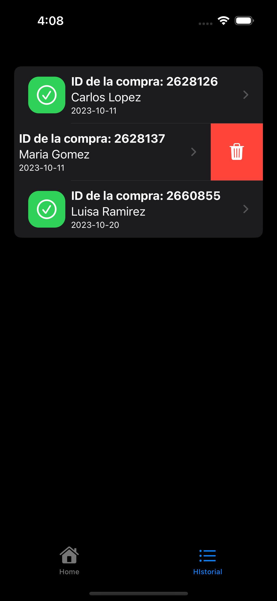

# PlacetoPay Redirection


With this example you will be able to quickly connect with the PlacetoPay Checkout Services.

In order to see more comprehensive examples of how it works, please refer to the examples and
the [docs page](https://docs.placetopay.dev/checkout)

***

## Table of Contents

### Integrating Checkout

- [Authentication](#authentication)
  - [Requirements](#requirements)
  - [How to generate your authentication](#how-to-generate-your-authentication)
- [Setup services](#setup-services)
- [Create session](#create-session)
- [Query a session](#query-a-session)
- [Settings your WebView](#settings-your-webview)
- [Possible errors in the WebView](#errors-webview)

### Sample App

- [Test your credentials](#test-your-credentials)
- [Preview](#preview)
- [Glossary](#glossary)

### Language
- [Spanish](README-es.md)

***

## Authentication

The auth parameter must be sent in **all API requests** and contains the set of properties needed to verify
authentication.

### Requirements

> To integrate with Checkout you must have your `login` and `secretKey` credentials.

- `login`: Site identifier, can be considered public as it travels as plain data in API requests.
- `secretKey`: Secret key of the site, it must be private, from this data a new tranKey will be generated that will be
  sent in the requests.

> These credentials are unique to your site and should be treated securely.
> 
> Do not share your credentials in public accessible areas such as Github, client-side code or other places easily to
> third parties.

### [How to generate your authentication](https://docs.placetopay.dev/en/checkout/authentication#how-to-generate-your-authentication)

You must know and prepare the following information:

| Parameter   | Description                                                                                                                                                                |
|:------------|:---------------------------------------------------------------------------------------------------------------------------------------------------------------------------|
| `login`     | Site identifier, credential provided when starting your integration.                                                                                                       |
| `secretKey` | Site secret key, credential provided when starting your integration.                                                                                                       |
| `seed`      | This is the date the authentication was generated. Date must be in ISO 8601 format.                                                                                        |
| `nonce`     | Random string value that identifies a request as unique. It is generated and used to create `tranKey` without base64 encoding. When sending it, it must be base64 encoded. |
| `tranKey`   | Generated on every request programmatically. It is generated with the following formulas Base64(SHA-256(nonce + seed + secretKey)).                                        |

> For this example, a Colombia environment is being used.
> For more information,
> see
> the [directory of environments](https://docs.placetopay.dev/en/checkout/test-your-integration#directory-of-environments)

***

The `CheckoutAuth` example class is used as a request parameter in authentication operations.
The class includes private methods for cryptographic computations, ensuring the security and confidentiality of the
authentication.

```swift
class CheckoutAuth: Codable {
    var login: String
    private(set) var nonce: String
    private(set) var seed: String
    private(set) var tranKey: String
    
    enum CodingKeys: String, CodingKey {
        case login, nonce, seed, tranKey
    }
    
    init(login: String, secretKey: String) {
        self.login = login
        self.seed = ""
        self.nonce = ""
        self.tranKey = ""
        self.generateAuth(secretKey: secretKey)
    }
    
    private func generateAuth(secretKey: String) {
        let rawNonce = UInt64.random(in: 0..<1000000)
        self.seed = ISO8601DateFormatter.string(from: Date(), timeZone: .current, formatOptions: .withInternetDateTime)
        let hashedData = SHA256.hash(data: "\(rawNonce)\(self.seed)\(secretKey)".data(using: .utf8)!)
        self.tranKey = Data(hashedData).base64EncodedString()
        self.nonce = Data(String(rawNonce).utf8).base64EncodedString()
    }
    
}
```

`CheckoutAuth` as a parameter in the request body in JSON.

```json
{
    "login": "c51ce410c124a10e0db5e4b97fc2af39",
    "tranKey": "VQOcRcVH2DfL6Y4B4SaK6yhoH/VOUveZ3xT16OQnvxE=",
    "nonce": "NjE0OWVkODgwYjNhNw==",
    "seed": "2023-10-17T16:22-0500"
}
```

> Frequent errors, see the [possible errors](https://docs.placetopay.dev/en/checkout/authentication#possible-errors)

***

### Setup services

Create the service interface with Retrofit for the [`Create Session`](#create-session)
and [`Query Session`](#query-a-session) endpoints.

> The implementation of the services must have as `baseUrl` the [environment](https://docs.placetopay.dev/en/checkout/test-your-integration#directory-of-environments) according to the app version.
> 
> The request __Body__ must contain the __auth__ parameter of type `CheckoutAuth` or the struct/class responsible for authentication.

```swift
protocol CheckoutRepository {
    func createSession(package: WelcomePackage, buyer: Buyer, ipAddress: String, handler: @escaping (Result) -> Void) async
    func searchSession(sessionId: Int, handler: @escaping (Result) -> Void) async
    ...
}

class CheckoutPaymentRepository: CheckoutRepository {
    var baseUrl: String
    
    init(baseUrl: String) {
        self.baseUrl = baseUrl
    }
    
    func createSession(package: WelcomePackage, buyer: Buyer, ipAddress: String, handler: @escaping (Result) -> Void) async {
        do {
            let paymentRequest:CheckoutPaymentRequest = .init(package: package, buyer: buyer, ipAddress: ipAddress)
            let body = try JSONEncoder().encode(paymentRequest)
            
            try await RequestManager().request(
                from: baseUrl + "/api/session",
                decodeType: CheckoutPaymentResponse.self,
                method: .post,
                body: body,
                completionHandler: handler
            )
        } catch _ {
            handler(ResultError(error: .networkError("Error connecting to server", 500)))
        }
    }
    
    func searchSession(sessionId: Int, handler: @escaping (Result) -> Void) async {
        ...
    }
    
    ...
}
```

***

### [Create session](https://docs.placetopay.dev/en/checkout/api-reference/session#create-a-session)

Creating a new payment request to obtain a session payment Url.

Just provide the information of the payment needed, and you will get a process url if its successful, for this example we
are using the **Basic Information** that needs to be provided, to see the full structure refer to
the [docs page](https://docs.placetopay.dev/en/checkout/create-session).

The `CheckoutPaymentRequest` example class is used as a body request. The class includes the payment, buyer, shipping
and other information.

```swift
struct CheckoutPaymentRequest: Codable {
    
    var auth: CheckoutAuth?
    var buyer: CheckoutBuyer?
    var cancelUrl: String?
    var captureAddress:Bool? = false
    var expiration: String
    var fields: [CheckoutField]?
    var locale: String
    var noBuyerFill: Bool? = false
    var payment: CheckoutPayment?
    var returnUrl: String
    var ipAddress: String
    var skipResult: Bool? = false
    var userAgent = USER_AGENT
    
    enum CodingKeys: String, CodingKey {
        case auth, buyer, cancelUrl, captureAddress, expiration, fields, locale, noBuyerFill, payment, returnUrl, ipAddress, skipResult, userAgent
    }
    
    init(package: WelcomePackage, buyer: Buyer, ipAddress: String) {
        self.auth = .init(login: LOGIN_CHECKOUT, secretKey: SECRET_KEY_CHECKOUT)
        self.buyer = .init(buyer: buyer)
        self.cancelUrl = CANCEL_URL
        self.expiration = Calendar.autoupdatingCurrent.date(byAdding: .day, value: 1, to: Date())!.toString()
        self.fields = nil
        self.locale = "es_CO"
        self.payment = .init(package: package, buyer: buyer)
        self.returnUrl = RETURN_URL
        self.ipAddress = ipAddress
    }
}
```

`CheckoutPaymentRequest` as a request body in JSON.

> See [full basic payment](examples/basic_payment_request.json)

```json
{
  "auth": {
    "login": "c51ce410c124a10e0db5e4b97fc2af39",
    ...
  },
  "expiration": "2023-10-17T23:13-0500",
  "locale": "es_CO",
  "payment": {
    "amount": {
      "currency": "COP",
      "details": [
        {
          "amount": 150000.0,
          "kind": "subtotal"
        },
        ...
      ],
      "total": 165000.0,
      ...
    },
    "buyer": {
      ...
    },
    "items": [
      {
        "category": "Books",
        "name": "Libro antiguo",
        "price": 80000,
        "qty": 1,
        "sku": 302,
        "tax": 15200.0
      },
      ...
    ],
    "reference": "3"
  },
  "returnUrl": "redirection://receipt?return",
  "userAgent": "Mozilla/5.0 (X11; Linux x86_64) Chrome/52.0.2743.116 Safari/537.36 ...",
  ...
}
```

The `CheckoutPaymentResponse` example class is used as a response body. The class includes the status, request id
and payment Url.

```swift
class CheckoutPaymentResponse: Decodable, Result {
    
    var status: CheckoutStatus
    var requestId: Int?
    var processUrl: String?
    var date: String?
}
```

`CheckoutPaymentResponse` as a response body in JSON.

```json
{
  "status": {
    "status": "OK",
    "reason": "PC",
    "message": "La petición se ha procesado correctamente",
    "date": "2023-10-18T15:02:20-05:00"
  },
  "requestId": 2630139,
  "processUrl": "https://checkout-test.placetopay.com/spa/session/2630139/7149a8cf3..."
}
```

---

### [Query a session](https://docs.placetopay.dev/en/checkout/api-reference/session#query-a-session)

This endpoint allows you to obtain the information of the session, if there are transactions in the session, the details
of the same are shown.

The `CheckoutInformationRequest` example class is used as a body request. The class include auth information.

```swift
struct CheckoutInformationRequest: Codable {
    var auth: CheckoutAuth
    
    enum CodingKeys: String, CodingKey {
        case auth
    }
    
    init() {
        self.auth = .init(login: LOGIN_CHECKOUT, secretKey: SECRET_KEY_CHECKOUT)
    }
}
```

`CheckoutInformationRequest` as a request body in JSON.

```json
{
  "auth": {
    "login": "c51ce410c124a10e0db5e4b97fc2af39",
    "nonce": "NjE0OWVkODgwYjNhNw==",
    "seed": "2023-10-17T17:13-0500",
    "tranKey": "VQOcRcVH2DfL6Y4B4SaK6yhoH/VOUveZ3xT16OQnvxE="
  }
}
```

The `CheckoutInformationResponse` example class is used as a response body. The class includes the status, request id
and payment information.

```swift
struct CheckoutInformationResponse: Decodable, Result {
    var status: CheckoutStatus
    var requestId: Int?
    var request: CheckoutPaymentRequest?
    var payment: [CheckoutPaymentInformation]?
}
```

`CheckoutInformationResponse` as a response body in JSON.

> See [full information response](examples/information_response.json)

```json
{
  "requestId": 2630139,
  "status": {
    "status": "APPROVED",
    "reason": "00",
    "message": "La petición ha sido aprobada exitosamente",
    "date": "2023-10-18T15:02:42-05:00"
  },
  "request": {
    "locale": "es_CO",
    "payer": {
      "document": "1040035001",
      ...
    },
    "payment": {
      "reference": "2",
      "amount": {
        "details": [
          {
            "kind": "shipping",
            "amount": 15000
          },
          ...
        ],
        "currency": "COP",
        "total": 65000
      },
      "items": [
        ...
      ],
      ...
    },
    "fields": [
      {
        "keyword": "_processUrl_",
        "value": "https://checkout-test.placetopay.com/spa/session/2630139/7149...",
        "displayOn": "none"
      },
      ...
    ],
    "returnUrl": "redirection://receipt?return",
    "userAgent": "Mozilla/5.0 (X11; Linux x86_64) Chrome/52.0.2743.116 Safari/537.36 ...",
    ...
  },
  "payment": [
    {
      "amount": {
        ...
      },
      "status": {
        "date": "2023-10-18T15:02:39-05:00",
        "status": "APPROVED",
        ...
      },
      "issuerName": "JPMORGAN CHASE BANK, N.A.",
      "paymentMethod": "visa",
      "processorFields": [
        {
          "value": "012988341",
          "keyword": "merchantCode",
          "displayOn": "none"
        },
        ...
      ],
      "paymentMethodName": "Visa",
      ...
    }
  ],
  "subscription": null
}
```

---

### Settings your Webview

You can use this view `CheckoutWebView` to correctly display Checkout.

These settings help optimize and customize the browsing experience within the WebView. It's important that you can
identify the return URL and cancellation URL to be able to close the WebView once the payment process is complete.

```swift
struct CheckoutWebView: UIViewRepresentable {
    let url: String
    
    func makeUIView(context: Context) -> WKWebView {
        let wkWebView = WKWebView()
        wkWebView.navigationDelegate = context.coordinator
        return wkWebView
    }
    
    func updateUIView(_ webView: WKWebView, context: Context) {
        let request = URLRequest(url: URL(string: url)!)
        webView.load(request)
    }
    
    func makeCoordinator() -> WebViewCoordinator {
        WebViewCoordinator(self)
    }
    
    class WebViewCoordinator: NSObject, WKNavigationDelegate {
        var parent: CheckoutWebView
        
        init(_ parent: CheckoutWebView) {
            self.parent = parent
        }
        
        func webView(_ webView: WKWebView, decidePolicyFor navigationAction: WKNavigationAction, decisionHandler: @escaping (WKNavigationActionPolicy) -> Void) {
            if navigationAction.navigationType == .other {
                if let urlStr = navigationAction.request.url?.absoluteString, urlStr == returnUrl || urlStr == cancelUrl {
                    parent.showWebView = false
                    decisionHandler(.cancel)
                    return
                }
            }
            
            decisionHandler(.allow)
        }
    }
}
    
```

> If cleaning cookies and webview data storage, see the [clean cookies and data storage](https://gist.github.com/AddsDev/833788605e42857ff266617535af3c09)

---

## Errors WebView

> To clear the WebView cache, refer to [How to remove cache in WKWebView?](https://stackoverflow.com/questions/27105094/how-to-remove-cache-in-wkwebview).

You may encounter one of the common errors in your integration with checkout:

- Enabling JavaScript in the WebView (_AppleWebKit has JavaScript enabled by default_)

> For iOS 14+ versions, WKWebpagePreferences should be used.

```swift
let webConfiguration = WKWebViewConfiguration()
        
if #available(iOS 14, *) {
    let preferences = WKWebpagePreferences()
    preferences.allowsContentJavaScript = true
    webConfiguration.defaultWebpagePreferences = preferences
} else {
    let oldPreferences = WKPreferences()
    oldPreferences.javaScriptEnabled = true
    oldPreferences.javaScriptCanOpenWindowsAutomatically = true
    webConfiguration.preferences = oldPreferences
}

...

let wkWebView = WKWebView(frame: .zero, configuration: webConfiguration)
```
- Clear cache, cookies, session storage, etc.

```swift
let webConfiguration = WKWebViewConfiguration()

let websiteDataTypes: Set<String> = WKWebsiteDataStore.allWebsiteDataTypes()
//OR
let websiteDataTypes: Set<String> = [
            WKWebsiteDataTypeCookies, //(iOS 9.0)
            WKWebsiteDataTypeMemoryCache, //(iOS 9.0)
            WKWebsiteDataTypeLocalStorage, //(iOS 9.0)
            WKWebsiteDataTypeSessionStorage, //(iOS 9.0)
            //WKWebsiteDataTypeOfflineWebApplicationCache, //(iOS 9.0)
            //WKWebsiteDataTypeIndexedDBDatabases, //(iOS 9.0)
            //WKWebsiteDataTypeWebSQLDatabases, //(iOS 9.0)
            //WKWebsiteDataTypeFetchCache, //(iOS 11.3)
            //WKWebsiteDataTypeServiceWorkerRegistrations, //(iOS 11.3)
            //WKWebsiteDataTypeDiskCache, //(iOS 9.0)
            //WKWebsiteDataTypeFileSystem, //(iOS 16.0)
            //WKWebsiteDataTypeSearchFieldRecentSearches, //(iOS 17.0)
        ];
let date = NSDate(timeIntervalSince1970: 0)

let webStorage = WKWebsiteDataStore.default()
webStorage.removeData(ofTypes: websiteDataTypes, modifiedSince: date as Date, completionHandler: { print("RemoveData WebView - Done")})

webConfiguration.websiteDataStore = webStorage

let wkWebView = WKWebView(frame: .zero, configuration: webConfiguration)
```

>To remove session cookies or HTTP header cookies

```swift
let wkWebView = WKWebView(...)
wkWebView.configuration.websiteDataStore.httpCookieStore.getAllCookies { cookies in
  for cookie in cookies {
    if cookie.isSessionOnly || cookie.isHTTPOnly {
        wkWebView.configuration.websiteDataStore.httpCookieStore.delete(cookie)
    }
  }
}
```
- Usage of user tracking, permission for __Tracking__ must be requested from the user. You can use this example to validate permission and implement it where required.

```swift 
import Foundation
...
import AppTrackingTransparency
import AdSupport

class .... : ... {

  func requestTrackingPermission(_ completion: @escaping (ATTrackingManager.AuthorizationStatus) -> Void) {
    ATTrackingManager.requestTrackingAuthorization(completionHandler: completion)
  }
  
  func isAuthorized() -> Bool {
    let status = ATTrackingManager.trackingAuthorizationStatus
    return status == ATTrackingManager.AuthorizationStatus.authorized
  }
  
  func updateTrakingStatus() {
    let status = ATTrackingManager.trackingAuthorizationStatus
      switch status {
      case .authorized:
        // racking authorization dialog was shown and we are authorized
        printDebug("Tracking - Authorized")
      case .denied:
        // Tracking authorization dialog was shown and permission is denied
        printDebug("Tracking - Denied")
      case .notDetermined:
        // Tracking authorization dialog has not been shown
        printDebug("Tracking - Not Determined")
      case .restricted:[PrivacyInfo.xcprivacy](p2pr%2FPrivacyInfo.xcprivacy)
        printDebug("Tracking - Restricted")
      @unknown default:
        printDebug("Tracking - Unknown")
      }
  } 
}
```
> Remember to add the description or purpose of tracking in the `Info.plist` file.

```xml
<?xml version="1.0" encoding="UTF-8"?>
<!DOCTYPE plist PUBLIC "-//Apple//DTD PLIST 1.0//EN" "http://www.apple.com/DTDs/PropertyList-1.0.dtd">
<plist version="1.0">
  <dict>
    ...
    <key>NSUserTrackingUsageDescription</key>
    <string>App would like to access IDFA for tracking purpose</string>
    ...
  </dict>
</plist>
```
> Remember to add the Nutrition Labels in the privacy file `PrivacyInfo.xcprivacy`. You can use this example, but remember to adjust it to your application's requirements.

```xml
<?xml version="1.0" encoding="UTF-8"?>
<!DOCTYPE plist PUBLIC "-//Apple//DTD PLIST 1.0//EN" "http://www.apple.com/DTDs/PropertyList-1.0.dtd">
<plist version="1.0">
<dict>
  <key>NSPrivacyCollectedDataTypes</key>
  <array>
    <dict>
      <key>NSPrivacyCollectedDataTypeTracking</key>
      <true/>
      <key>NSPrivacyCollectedDataTypeLinked</key>
      <true/>
      <key>NSPrivacyCollectedDataTypePurposes</key>
      <array>
          <string>App would like to access IDFA for tracking purpose</string>
      </array>
      <key>NSPrivacyCollectedDataType</key>
      <string>NSPrivacyCollectedDataType...</string>
    </dict>
  </array>
  <key>NSPrivacyTrackingDomains</key>
  <array>
    <string>dominio.com</string>
    ....
  </array>
  <key>NSPrivacyTracking</key>
  <true/>
</dict>
</plist>
```
> ⚠️ Remember that you can use this repository to test your credentials or visit [P2p Client](https://dnetix.co/p2p/client). If you encounter other errors in the integration, visit [Common Errors](https://docs.placetopay.dev/checkout/authentication#possible-errors).
## Test your credentials

- Clone this repository on your local machine.

```
git clone https://github.com/placetopay-org/checkout-ios.git
```

- Open project in XCode.
- Configure your `login`, `secretKey` and `urlEnvironment` credentials in



- Build and run.

---

## Preview








---

### Glossary

| Name        | Description                                                                                                           |
|:------------|:----------------------------------------------------------------------------------------------------------------------|
| `login`     | Site identifier, it can be considered public because it travels as plain data in API requests.                        |
| `secretKey` | Secret key of the site, it must be private, from this data a new `tranKey` will be generated and sent in the request. |
| `tranKey`   | Generated on every request programmatically.                                                                          |
| `nonce`     | Arbitrary value that identifies a request as unique.                                                                  |
| `seed`      | This is the date the authentication was generated.                                                                    |
| `baseUrl`   | [Environment URL](https://docs.placetopay.dev/en/checkout/test-your-integration#directory-of-environments).           |
